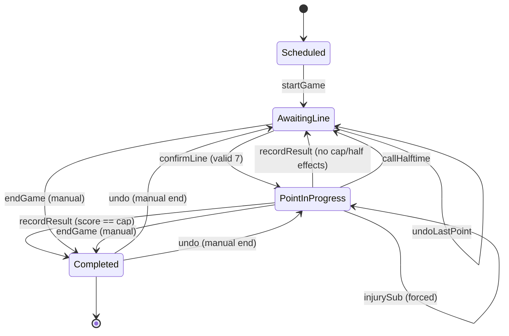

# Design Doc: Ultimate Frisbee Line-Calling App

| | |
|---|---|
| **Author** | Myron |
| **Status** | Draft — v0.5 |
| **Last updated** | 2026-06-29 |
| **Reviewers** | _TBD_ |

---

## 1. Overview

A web application that helps a coach manage **line calling** during an ultimate
frisbee game — i.e. choosing which 7 players take the field for each point — while
the app enforces the rules that constrain that choice: the gender ratio for the
point (in mixed), whether the team is on offense or defense, and the current state
of the game (score, half, timeouts).

The app is sideline-first: it will be used live, on a phone or tablet, often with
poor connectivity, by a coach who needs to make a decision in the ~30 seconds
between points. Speed, correctness, and reliability under bad network conditions
are the dominant design constraints.

### Why this is non-trivial

The core complexity isn't CRUD — it's a small but fiddly **game state machine**.
Three things mutate every point and each follows a different rule:

- **Gender ratio** advances on an `ABBA` cycle (mixed only).
- **Offense/Defense** is usually decided by who scored, but is *overridden* at
  halftime.
- **Halftime** can be triggered either by reaching the half score *or* manually
  (time cap), and that transition has side effects (O/D flip, timeout reset).

Getting this logic right and presenting it as a one-tap decision is the heart of
the product.

---

## 2. Goals & Non-Goals

### Goals

- **Phone-number login** with a one-time onboarding step (first/last name).
- Model teams, players, tournaments, and games.
- A **team roster**, with each tournament drawing a **subset** of that roster.
- Run a live game: track score, half, timeouts, and O/D.
- Compute and display the **required gender ratio** per point via the ABBA rule.
- Let the coach **call a line** (pick 7 from the available roster) with the ratio
  enforced as a validation.
- **Advance the game point-by-point** from clear on-screen controls.
- **Auto-count points played** per player, live, and surface it during line calls.
- Handle **injuries**: lock a hurt player out of future lines and force a hot-sub.
- **Undo the last point** (one step), and **edit any past line** after the fact.
- Correctly handle the **halftime** transition (manual or score-triggered).
- Work **offline** and reconcile when connectivity returns.

### Non-Goals (v1)

- Multiple managers per team. v1 is **single-manager** (one owner per team).
- Per-throw event logging (turns, Ds, completions). We record only the point
  result and injury subs. (See Future Enhancements.)
- Opponent roster management. We track the opponent as a name + score only.
- Tournament bracket/seeding logic or score reporting to USAU.
- Native mobile apps. This is a responsive web app (PWA).

---

## 3. Glossary

For reviewers who don't play ultimate:

- **Point** — a single scoring sequence. One team pulls (kicks off), the other
  receives; play continues until someone scores. Each point increments exactly one
  team's score by 1.
- **Pull** — the throw that starts a point. The team that pulls is on **defense**;
  the team that receives is on **offense**.
- **Line** — the 7 players a team puts on the field for a point. "Calling the line"
  = choosing those 7.
- **O / D** — Offense / Defense. The receiving team is on O; the pulling team is
  on D.
- **Game cap** — the score that ends the game (13 or 15 here). First to cap wins.
- **Half** — the game pauses at a fixed score (7 for a 13-cap, 8 for a 15-cap).
- **Division** — Mixed, Open, or Women. Gender ratios only apply to Mixed.
- **MMP / WMP** — "Man-matching player" / "Woman-matching player". The gender
  category used to enforce ratios in Mixed.
- **Gender ratio** — in Mixed, the required split of MMP/WMP on the field for a
  point, e.g. 4 MMP + 3 WMP.
- **ABBA** — the pattern by which the ratio alternates point-to-point (defined
  in §5).

---

## 4. Domain Model

Entities and their relationships. Types are shown in TypeScript as the canonical
schema.

```
User 1───* Team 1───* Player
              Team 1───* SavedLine
              Team 1───* Tournament 1───* TournamentRoster (subset of Players)
                                   └──* Game 1───* Point
```

### 4.0 User & Accounts

A coach is a `User`, identified by their **phone number**. A user can own multiple
teams; each team has exactly one owner (v1 is single-manager — see Non-Goals).

```ts
interface User {
  id: string;
  phoneNumber: string;   // E.164, e.g. "+14155550123". Unique. The login identity.
  firstName: string;
  lastName: string;
  createdAt: string;
}
```

**Login flow (phone OTP + onboarding):**

1. User enters their phone number.
2. Server sends a 6-digit one-time code via SMS.
3. User enters the code; server verifies and issues a session token.
4. **First time only:** the user has no `firstName`/`lastName` yet → show a short
   onboarding screen to capture them. Returning users skip straight in.
5. The session token is cached on-device so the app stays authenticated **offline**
   after the first successful login (see §10).

> Auth is the one flow that requires connectivity — you log in when you have signal,
> then run games offline. The token persists locally; we don't force re-auth on the
> sideline.

### 4.1 Team & Player

```ts
type Division = "mixed" | "open" | "women";
type Role = "handler" | "cutter" | "both";
type GenderMatch = "MMP" | "WMP";

interface Team {
  id: string;
  ownerId: string;       // the single managing User
  name: string;
  division: Division;
  createdAt: string;
}

interface Player {
  id: string;
  teamId: string;
  name: string;
  // Required to call lines against a gender ratio in Mixed.
  // For Open/Women this is informational and not used for line validation.
  genderMatch: GenderMatch;
  role: Role;            // freely editable any time, even mid-tournament
  jerseyNumber?: number;
  createdAt: string;
}
```

The **team roster** is every `Player` on the team — the persistent source of truth.
Availability for any given event is governed by the tournament roster (§4.2), not a
flag on the player.

> **Note — added field.** The original spec gives players a name and a role but no
> gender. Enforcing the ABBA ratio requires knowing each player's gender match, so
> `genderMatch` is added to `Player`. It is **immutable once a tournament has
> started** (§12); `role` stays freely editable.

### 4.2 Tournament, Roster & Game

A `Tournament` draws a **subset** of the team roster via `TournamentRoster`
(check-in: who's actually here this weekend). Everyone on the tournament roster is
available to play by default; the only thing that pulls a player out is an
**injury**, tracked per tournament so it carries across that tournament's games
until cleared.

```ts
// Mixed-only: which gender is in the majority for a given point.
type GenderRatio = "4MMP_3WMP" | "4WMP_3MMP";
type OD = "O" | "D";
type GameCap = 13 | 15;

interface Tournament {
  id: string;
  teamId: string;
  name: string;
  division: Division; // should match the team's division
  startDate: string;
  endDate?: string;
  started: boolean;   // locks genderMatch edits for rostered players
  createdAt: string;
}

// Which team players are present for this tournament (a filtered view of the roster).
interface TournamentRoster {
  id: string;
  tournamentId: string;
  playerId: string;
  injured: boolean;   // default false; toggleable; locks the player out of new lines
  createdAt: string;
}

interface Game {
  id: string;
  tournamentId: string;
  opponentName: string;
  gameCap: GameCap;
  // Derived: 7 if cap 13, 8 if cap 15. Stored for convenience.
  halfScore: number;
  timeoutsPerHalf: number;

  // Mixed only. Null/ignored for Open & Women.
  startingGenderRatio?: GenderRatio;

  // O or D for the very first point of the game.
  startingOD: OD;

  status: "scheduled" | "in_progress" | "completed";
  createdAt: string;
}
```

**Eligibility for a line** = a player who is (a) on the tournament roster and
(b) not currently `injured`. Injury is the single availability lever.

### 4.3 Saved Lines

A `SavedLine` is a named, reusable group of players, scoped to the **team**. It can
be a full line (7) or a smaller **pod** — a chemistry group you like to put on
together (e.g. a 3-handler core, a deep-cutting duo).

```ts
interface SavedLine {
  id: string;
  teamId: string;
  name: string;          // "O-line", "Zone D", "Handler core"
  playerIds: string[];   // 1..7 players (a full line or a partial pod)
  createdAt: string;
}
```

Saved lines are **templates, not commitments**: applying one pre-selects those
players in the line builder, then the normal ratio validation decides whether it can
be confirmed as-is or needs filling/adjusting. Injured or off-roster players in a
saved line are skipped on apply and the empty slot must be filled (§8).

### 4.4 Point (the game log)

Each point is recorded, giving us history, undo, edit, and stats. The live game
state is *derived* by folding over the point log, plus a small amount of explicit
state (timeouts, halftime flag).

```ts
interface Substitution {
  injuredPlayerId: string;       // was on the field when the point started
  replacementPlayerId: string;   // came on mid-point
}

interface Point {
  id: string;
  gameId: string;
  pointNumber: number;       // 1-based ordinal across the whole game
  od: OD;                    // O or D for this point
  genderRatio?: GenderRatio; // mixed only; LOCKED for this point ordinal (ABBA)
  lineup: string[];          // the STARTING 7 for the point
  substitutions?: Substitution[]; // mid-point injury swaps (history; see below)
  result?: "us" | "them";    // who scored; undefined while point in progress
  isFirstAfterHalftime: boolean;
}

interface LiveGameState {
  gameId: string;
  currentPointNumber: number;
  ourScore: number;
  theirScore: number;
  od: OD;                    // O/D for the upcoming/current point
  genderRatio?: GenderRatio; // required ratio for the current point (mixed)
  halftimeReached: boolean;
  ourTimeoutsRemaining: number;
  theirTimeoutsRemaining: number;
  phase: "scheduled" | "awaiting_line" | "point_in_progress" | "completed";

  // Auto-counted: playerId -> number of points they STARTED.
  pointsPlayed: Record<string, number>;
}
```

**Points played is derived, not stored.** It counts the **starting lineup** of each
completed point. An injured starter who got subbed out mid-point still counts (they
took the field when the point started); their replacement does **not** (they came on
mid-point). Because `lineup` always holds the starting 7, this is simply:

```ts
function pointsPlayed(points: Point[]): Record<string, number> {
  const counts: Record<string, number> = {};
  for (const p of points) {
    if (p.result === undefined) continue;      // only completed points count
    for (const id of p.lineup) counts[id] = (counts[id] ?? 0) + 1;
    // substitutions[].replacementPlayerId intentionally NOT counted
  }
  return counts;
}
```

This stays correct through undo and through edit-line-history (§7) — recompute from
the log, no counter to drift.

---

## 5. Gender Ratio: the ABBA Algorithm

**Applies to Mixed only.** Open and Women games skip this entirely — a line is
just any 7 eligible players.

The game's `startingGenderRatio` defines ratio **A**. Ratio **B** is its inverse.
The ratio for each successive point follows the cycle:

```
Point:  1  2  3  4 | 5  6  7  8 | 9 ...
Ratio:  A  B  B  A | A  B  B  A | A ...
```

The pattern is a pure function of the **point ordinal** (the number of points
played so far, regardless of the score). It **continues across halftime** — no
reset (confirmed):

```ts
function ratioForPoint(pointNumber: number, startA: GenderRatio): GenderRatio {
  const phase = (pointNumber - 1) % 4;      // 0,1,2,3
  const isA = phase === 0 || phase === 3;   // A B B A
  return isA ? startA : invertRatio(startA);
}

function invertRatio(r: GenderRatio): GenderRatio {
  return r === "4MMP_3WMP" ? "4WMP_3MMP" : "4MMP_3WMP";
}
```

### Worked example — `startingGenderRatio = 4MMP_3WMP`

| Point | Phase | Ratio | On field |
|------:|:-----:|:-----:|:---------|
| 1 | A | 4MMP/3WMP | 4 men-matching, 3 women-matching |
| 2 | B | 4WMP/3MMP | 4 women-matching, 3 men-matching |
| 3 | B | 4WMP/3MMP | … |
| 4 | A | 4MMP/3WMP | … |
| 5 | A | 4MMP/3WMP | … |
| 6 | B | 4WMP/3MMP | … |
| 7 | B | 4WMP/3MMP | … |
| 8 | A | 4MMP/3WMP | … |

Each point's ratio is **snapshotted onto the `Point`** when confirmed, so it's
locked for that ordinal — which is what makes safe after-the-fact line edits
possible (§7).

---

## 6. Offense / Defense & Halftime

O/D for each point is decided by these rules, in priority order:

1. **First point of the game** → `game.startingOD`.
2. **First point after halftime** → the *inverse* of `game.startingOD`. (Whoever
   received to open the game pulls to open the second half.)
3. **Any other point** → decided by who scored the previous point. *The scoring
   team pulls next point, so they're on D; the scored-on team is on O.* Computed
   automatically — there is no manual per-point O/D toggle.

```ts
function odForPoint(
  pointNumber: number,
  game: Game,
  prev: Point | null,
  isFirstAfterHalftime: boolean
): OD {
  if (pointNumber === 1) return game.startingOD;
  if (isFirstAfterHalftime) return invertOD(game.startingOD);
  return prev!.result === "us" ? "D" : "O";
}

const invertOD = (od: OD): OD => (od === "O" ? "D" : "O");
```

### Halftime

Halftime is a **one-time event** triggered by *either*:

- a team's score reaching `halfScore` (7 or 8), **or**
- the coach calling it manually (time cap), at any score.

When it fires it:

1. sets `halftimeReached = true`,
2. arms a one-shot override so the **next** point uses rule (2) above, and
3. resets each team's timeouts to `timeoutsPerHalf`.

The transition is idempotent: if the coach manually called half at 5–4, a later
score of 7 does **not** trigger it again.

---

## 7. Game State Machine

The game is modeled as an explicit finite state machine. Live state is derived by
replaying the point log + applying events; this makes **undo** and **edit** trivial
(change the log and recompute) and keeps the rules in one place.



### Transition: `recordResult(scorer)`

The most important transition. Pseudocode:

```ts
function recordResult(state, point, scorer: "us" | "them") {
  point.result = scorer;
  if (scorer === "us") state.ourScore++; else state.theirScore++;

  // 1. Game over?
  if (state.ourScore === game.gameCap || state.theirScore === game.gameCap) {
    state.phase = "completed";
    return;
  }

  // 2. Did this score reach half? (only if not already past half)
  let pendingHalftimeOverride = false;
  if (!state.halftimeReached &&
      (state.ourScore === game.halfScore || state.theirScore === game.halfScore)) {
    state.halftimeReached = true;
    pendingHalftimeOverride = true;
    resetTimeouts(state, game.timeoutsPerHalf);
  }

  // 3. Advance to the next point.
  advancePoint(state, game, point, pendingHalftimeOverride);
}

function advancePoint(state, game, prev, isFirstAfterHalftime) {
  const n = state.currentPointNumber + 1;
  state.currentPointNumber = n;
  state.od = odForPoint(n, game, prev, isFirstAfterHalftime);
  state.genderRatio = game.division === "mixed"
    ? ratioForPoint(n, game.startingGenderRatio!)
    : undefined;
  state.phase = "awaiting_line";
}
```

### Injury substitution (forced)

`injurySub(injuredPlayerId, replacementPlayerId)` is available during
`point_in_progress`:

- Appends `{ injuredPlayerId, replacementPlayerId }` to the current point's
  `substitutions`.
- Marks the injured player `injured = true` on the tournament roster (locks them out
  of future lines until cleared).
- The replacement must be **eligible** (on roster, not injured) and not already on
  the line. The injured player still counts for this point; the replacement does not.

When a player is flagged injured, the UI **forces** the coach to choose a
replacement before any other action can proceed (you can't leave the field at 6).

### Undo — one step only

`undoLastPoint()` reverts **only the most recently completed point**:

- Drops that point's `result`, returning the game to `awaiting_line` for that point
  with its line pre-selected, so the coach can re-call it.
- Re-derives score, O/D, ratio, halftime, timeouts, and points-played from the log.
- It is **strictly one level deep** — you can always undo the latest point, but you
  cannot chain undos backward through history. To fix an older point, use Edit line
  history. This prevents accidentally unwinding the whole game with repeated taps.

### Edit line history

`editPointLineup(pointId, newLineup)` lets the coach correct a *past* point's 7
after the fact (wrong call, mis-tap):

- Allowed on **any** completed point in the game.
- The point's `genderRatio` is **locked** (set by ABBA for that ordinal), so the new
  lineup must satisfy that exact ratio — the editor enforces it just like a live
  line call.
- Editing a lineup does **not** change results/score, so nothing cascades; only
  `pointsPlayed` recomputes from the log.
- (Editing results/score is intentionally out of scope, since that would cascade O/D
  and ratios across every later point.)

### Other events

- `callHalftime()` — if `!halftimeReached`: set the flag, reset timeouts, and arm
  the override so the next `advancePoint` flips O/D. (If half already happened,
  no-op with a warning.)
- `callTimeout(team)` — decrement that team's remaining timeouts (block at 0).
  Does not advance the point.
- `endGame()` — manually completes the game at the current score (time/mercy),
  regardless of cap. Sets `phase = "completed"` without recording a point result.
  It is **one-step undoable** like a point: undo returns the game to its prior phase
  (`awaiting_line` or `point_in_progress`) with score/state re-derived from the log.
  Reaching the cap still auto-completes via `recordResult` (§7); this is the
  *manual* path to the same terminal state.

---

## 8. Line-Calling Feature (core UX)

The screen a coach lives on during a game. Optimized for a glance + a few taps.

### Information shown each point

- Point number and score (e.g. `Point 9 · 5–3`).
- **O or D** (big, color-coded — it changes how you pick the line).
- **Required ratio** (Mixed): `4 MMP / 3 WMP`, with a live counter as you pick.
- Timeouts remaining.
- **Points played** next to each player (the auto-count), to balance time at a
  glance. Injured players appear locked/greyed with an injury marker.

### Control layout

Two phases, two control sets, both thumb-reachable:

- **`awaiting_line`** — the roster + a single primary **Confirm line** button
  (disabled until the line is valid). Plus **Undo last point** and **Edit history**.
- **`point_in_progress`** — the two **next-point** buttons advance the game:
  - **`We scored ▸`** and **`They scored ▸`** — recording the result *is* the
    transition to the next point. One tap: score updates, points-played increments,
    halftime/game-over is checked, and the app drops into `awaiting_line` for the
    next line with the new O/D and ratio already computed.
  - **`Injury`** — flag a hurt player; the UI immediately **forces a hot-sub** from
    the eligible pool before anything else can happen.
  - Secondary controls: **Halftime**, **Timeout (us / them)**.

### Flow

1. State `awaiting_line`. Eligible roster shown (on tournament roster, not injured),
   grouped by gender match (Mixed), each with its points-played count.
2. Coach builds the line by tapping players, or taps a **saved line** to drop a
   line/pod in at once. A live counter shows `MMP 3/4 · WMP 2/3`.
3. **Confirm line** is enabled only when the line is valid (see rules). Confirm →
   `point_in_progress`.
4. Coach taps **We scored** / **They scored** to advance (or **Injury** to hot-sub).
5. **Halftime** and **Timeout** are always-available controls.
6. **Undo last point** steps back one point; **Edit history** fixes any past line.

### Injury handling (UX)

- **Mid-point:** tap **Injury** → pick the player → the UI **blocks** until you pick
  a replacement from the eligible pool. The swap is logged; the injured player is now
  locked out of future lines.
- **Next line call:** an injured player can't be selected. If they were in a
  pre-filled line (a saved line or the carried-over previous line), their slot shows
  as **empty/flagged** and **Confirm is disabled until you fill it**. No "ghost"
  injured players slip onto a line.
- **Recovery:** injury is **toggleable** — clear it and the player is eligible again.
- Injury is **tournament-scoped**: it persists across that tournament's games until
  cleared, so a player hurt in game 1 stays locked in game 2 unless you un-injure
  them.

### Saved lines (quick fill)

A **Saved lines** drawer sits next to the roster:

- Tapping a saved line **adds** its players to the current selection (stack pods:
  "handler core" + "deep cutters" + fill the last spot).
- The live ratio counter and validation update as normal — a saved line is a fast
  selection, never an automatic confirm.
- Over-ratio additions are flagged (not silently dropped) so the coach chooses who
  to keep; injured/off-roster members are skipped with a "1 unavailable" note.
- **Save current line** — name and store whatever's selected (full 7 or a pod) as a
  new `SavedLine` for the team.

### Line validation rules

- Exactly **7** players, no duplicates, all **eligible** (on tournament roster, not
  injured).
- **Mixed**: `count(MMP)` and `count(WMP)` exactly match the required ratio. (Hard
  block.)
- **Open / Women**: any 7 eligible players. No ratio constraint.
- **Soft warnings** (non-blocking, dismissible):
  - No handler on the line.
  - A player is well above the squad's average points played (time imbalance), or
    has played many points in a row.

### Carry-over convenience

Lines often stay similar point-to-point, so after a score the previous line is
pre-selected as a starting point; the coach removes/swaps players rather than
rebuilding. Injured players are stripped from the carry-over and their slots flagged.
Validation still runs before confirm.

---

## 9. API Design

REST, JSON. Resource-oriented; the live game is driven by event endpoints rather
than PATCHing fields, which keeps the rules server-authoritative.

**Auth**
```
POST   /auth/otp/request       # { phoneNumber } -> sends SMS code
POST   /auth/otp/verify        # { phoneNumber, code } -> { token, isNewUser }
POST   /users/me               # onboarding: { firstName, lastName } (new users)
GET    /users/me
```

**Teams & players**
```
POST   /teams
GET    /teams                  # teams owned by the authed user
GET    /teams/:id
POST   /teams/:id/players
PATCH  /players/:id            # name, role, jersey (genderMatch only pre-tournament)
DELETE /players/:id            # blocked if the player has played any points (§12)
GET    /players/:id/usage      # games/points this player appears in (for delete UX)
```

**Saved lines**
```
GET    /teams/:id/saved-lines
POST   /teams/:id/saved-lines  # { name, playerIds[] }
PATCH  /saved-lines/:id        # rename / change players
DELETE /saved-lines/:id
```

**Tournaments, roster & games**
```
POST   /tournaments
GET    /tournaments/:id
POST   /tournaments/:id/games
GET    /tournaments/:id/roster              # { playerId, injured } for the event
POST   /tournaments/:id/roster              # add players to the tournament roster
DELETE /tournaments/:id/roster/:playerId    # remove from this tournament only
PATCH  /tournaments/:id/roster/:playerId    # { injured: true|false } toggle
GET    /games/:id
GET    /games/:id/state        # derived LiveGameState (incl. pointsPlayed)
```

**Live game events** (the state machine)
```
POST   /games/:id/start
POST   /games/:id/points              # confirm line -> { lineup: [..7] }
POST   /games/:id/points/:pid/result  # { scorer: "us" | "them" }
POST   /games/:id/points/:pid/sub     # injury hot-sub { injuredPlayerId, replacementPlayerId }
PATCH  /games/:id/points/:pid/lineup  # edit a past line { lineup: [..7] } (ratio-checked)
POST   /games/:id/halftime
POST   /games/:id/timeout             # { team: "us" | "them" }
POST   /games/:id/end                 # manual end at current score (undoable)
POST   /games/:id/undo                # reverts the most recent point OR a manual end
```

Each event endpoint returns the updated `LiveGameState` (including the live
`pointsPlayed` map), so the client always has the latest derived view in one round
trip.

---

## 10. Architecture & Tech Stack

### Recommended stack

| Layer | Choice | Why |
|---|---|---|
| Frontend | **Next.js + TypeScript** (App Router, React) | One framework for routing, SSR for the marketing/auth shell, and a static-exportable PWA for the live game. Typed end-to-end. |
| State / FSM | **Zustand** + a hand-rolled reducer (or **XState**) | The game is a state machine; modeling it explicitly is the whole point. XState gives a visualizable machine; Zustand keeps it light. |
| Styling | **Tailwind**, mobile-first | Sideline use = thumb-driven, large tap targets. |
| Local persistence | **`localStorage`** (JSON snapshots, namespaced per game) + an outbox queue | Offline-first; the app reads/writes locally first and syncs opportunistically. See below. |
| Backend | **Bun + TypeScript** (e.g. `Bun.serve` or Hono on Bun) | Fast, single-binary, native TS — no build step. Hosts the thin event API and is the **authoritative rules validator**. |
| Auth | **Supabase Auth** — Phone OTP (SMS) | Native SMS-OTP, issues a JWT session, no passwords. The token is cached on-device for offline use. |
| DB | **Supabase (Postgres)** | Managed Postgres for the durable game log; relational model fits cleanly. Row-Level Security scopes data per owner. |
| Shared logic | **`@shared/game-rules`** package (TS) | `ratioForPoint` / `odForPoint` / `pointsPlayed` etc. imported by **both** the Next.js client and the Bun server so the rules are identical on each side (§11). |
| Delivery | **PWA** (installable, offline) | No app stores; works on any sideline device. |

> **Why a separate Bun server in front of Supabase?** Per §11 the rules must be
> **server-authoritative** so a stale/buggy client can't corrupt a game. The Bun
> server validates every event against `@shared/game-rules`, then writes to
> Postgres. Supabase here is "managed Postgres + Auth," not the app's only backend —
> the client does **not** write game state directly to Supabase. (Direct
> `supabase-js` access with RLS remains a fallback option if we ever want to drop
> the Bun tier, at the cost of moving validation into Postgres/RLS.)

### Request / data flow

```
┌─────────────────────────── device (offline-capable PWA) ───────────────────────────┐
│  Next.js client                                                                     │
│    UI ──▶ Zustand FSM ──▶ append event to local point log (localStorage)            │
│                              │                                                       │
│                              └─▶ derive LiveGameState (via @shared/game-rules) ──▶ UI│
│                              └─▶ enqueue event in outbox (localStorage)              │
└──────────────────────────────────────────┬──────────────────────────────────────────┘
                                            │  (when online)
                                            ▼
                         Bun server  ──▶ validate event w/ @shared/game-rules
                                      ──▶ verify Supabase JWT
                                      ──▶ upsert (idempotent by event id) into Postgres
                                            │
                                            ▼
                                    Supabase (Postgres + Auth)
```

The Next.js app is essentially a client-rendered PWA for the live-game surface
(the line caller must run with zero network), with SSR reserved for the
login/marketing shell. Auth (OTP request/verify) goes to Supabase; everything else
— teams, tournaments, games, and the live event endpoints from §9 — is served by the
Bun API.

> **Auth + offline.** OTP login needs network, so you authenticate before heading to
> the field. The Supabase session token (JWT) is cached on-device in `localStorage`,
> so every game runs fully offline afterward — the app never bounces you to a login
> screen mid-game. Tokens refresh silently the next time there's signal.

### Offline-first is the key architectural decision

Tournaments happen on fields with terrible connectivity. The app **must** keep
working with no network. Design:

- The **point log is the source of truth** and is recorded locally first.
  `LiveGameState` is derived from it, so the UI never waits on the network.
- **`localStorage` is the on-device store for v1.** State is held as JSON keyed per
  game (e.g. `game:<id>:log`, `game:<id>:meta`) plus a global `outbox`. It's
  synchronous, universally available, and trivial to reason about — a good fit for
  the small, append-mostly game log. *Trade-off:* `localStorage` is string-only,
  ~5 MB, and synchronous; if the log size or query needs grow we migrate the same
  abstraction to **IndexedDB (via Dexie)** behind an unchanged store interface.
- Mutations go into a local **outbox** and sync to the Bun server opportunistically
  (on reconnect, on app focus, on a timer).
- Each event carries a client-generated `id` and a `pointNumber`/sequence so the
  server can **dedupe and order** idempotently. Replaying the same event twice is a
  no-op (Postgres upsert on event `id`).
- Conflict policy for v1: a game is "owned" by one device (and one manager), so
  last-writer-wins within a single device's monotonic log is sufficient.

This is also the most *interesting* part to build and a strong portfolio
talking point: an offline-first event-sourced state machine with idempotent sync.

---

## 11. Key Technical Decisions & Trade-offs

1. **Event-sourced game log vs. mutable state.** Chosen: log. Trade-off: slightly
   more code to derive state, but undo, edit, audit, offline sync, and stats all
   fall out for free.
2. **Server-authoritative rules vs. client-only.** Chosen: rules live in shared TS
   and run on **both** sides; the server validates so a buggy/stale client can't
   corrupt a game. Trade-off: logic in one shared package (a monorepo
   `@shared/game-rules` module).
3. **Ratio/O-D as derived vs. stored per point.** Chosen: derived by pure
   functions, then snapshotted onto each `Point` when confirmed. Recomputation is
   cheap, the historical record is immutable, and past-line edits have a fixed ratio
   to validate against.
4. **Hard block vs. allow-override on gender ratio.** Chosen: hard block. The whole
   value proposition is enforcing the rule.
5. **One-step undo vs. full undo stack.** Chosen: one step, with a separate explicit
   edit-history tool. Protects against fat-fingered cascades while still allowing any
   correction.

---

## 12. Edge Cases

- **Cap reached before half** — impossible (half < cap), but `recordResult` checks
  cap first regardless, so ordering is safe.
- **Manual halftime then score reaches half** — idempotent; second trigger is a
  no-op (timeouts don't double-reset).
- **Manual halftime called at game point** — allowed but unusual; flips O/D for the
  (possibly final) next point. Harmless.
- **Timeout at 0 remaining** — blocked with a message.
- **Undo across a halftime / game-end boundary** — the one-step undo recomputes the
  halftime flag and timeouts from the log, so the boundary is handled.
- **Undo attempted twice** — blocked after one step; older corrections go through
  Edit line history.
- **Open/Women game** — `genderRatio` is `undefined` everywhere; line validation
  drops to "exactly 7 eligible".
- **Division mismatch** (mixed tournament, non-mixed team) — validated at game
  creation.
- **Editing a player's role** — allowed any time, including mid-tournament. No effect
  on history or ratio validation.
- **Editing a player's genderMatch** — **blocked once the tournament has started**
  (`tournament.started`). Fix by removing the player from the tournament roster and
  re-adding, or an admin override for data-entry mistakes.
- **Deleting a player from the team** — blocked if they've played any points; the API
  returns their usage so the coach can keep them for history or edit those lines
  first. Removing them from a single **tournament roster** is always fine.
- **Injured player mid-point** — UI forces an immediate hot-sub before any other
  action; injured player counts for that point, replacement doesn't.
- **Injured player in a saved/carried-over line** — slot is flagged empty; Confirm is
  disabled until filled.
- **Un-injuring a player** — toggling `injured = false` makes them eligible again;
  past points already played are unaffected.
- **Replacement equals injured player, or not eligible** — blocked with a message.
- **Editing a past line that breaks the locked ratio** — blocked; the editor enforces
  that point's ABBA ratio.
- **Saved line that violates the current ratio** — allowed as a selection; just won't
  pass validation until corrected (the same group can be legal on an A point, not a
  B point).

---

## 13. Resolved Decisions & Remaining Open Questions

### Resolved (confirmed)

1. **Player gender attribute** — ✅ `genderMatch` on `Player`; **immutable once the
   tournament starts**. `role` freely editable.
2. **ABBA at halftime** — ✅ **continues** across halftime (pure function of the
   cumulative point ordinal; no reset).
3. **Normal-point O/D** — ✅ computed **automatically** (scoring team pulls → on D),
   with the halftime flip. No manual per-point toggle.
4. **Single manager** — ✅ one owner per team; no assistant managers in v1.
5. **Tournament roster** — ✅ a tournament draws a subset of the team roster
   (`TournamentRoster`). All rostered players are available; **injury** is the only
   availability lever, tracked per tournament and toggleable.
6. **Injuries** — ✅ flag → lock out of future lines → forced hot-sub; injured starter
   counts the point, replacement doesn't; un-injurable.
7. **Undo** — ✅ one step back only; **Edit line history** handles older corrections
   and must respect each point's locked ratio.
8. **Win condition** — ✅ **hard cap** (first to cap wins) **plus a manual, undoable
   "End game"** control the coach can trigger at any score (time/mercy). No
   win-by-2 or universe point. The manual end is reversible via one-step undo (§7).
9. **Timeouts** — ✅ **per half**; both teams reset to `timeoutsPerHalf` when halftime
   fires. Count is set per game at creation.
10. **Opponent tracking** — ✅ **score and timeouts only** (`opponentName`,
    `theirScore`, `theirTimeoutsRemaining`). No opponent roster or gender ratio.
11. **Time/soft cap** — ✅ **manual halftime is the only time-based control** in v1;
    no automatic soft-cap math or game clock.
12. **Offline scope** — ✅ **live game only.** Only the live caller reads/writes the
    local (`localStorage`) log and works with no network. All setup (teams, players,
    tournaments, game creation) is **online-only**; the tournament roster + injury
    state is **snapshotted onto the game at Start** so it's available offline.
13. **Concurrency** — ✅ **multiple concurrent live games** are allowed on one device
    (e.g. two fields). Each game is an independent, namespaced local log; the app
    shell provides a **game switcher** rather than a single resume slot.
14. **Forms UI (modal vs. route)** — ⏳ decided **per-form as we build**. Rule of
    thumb: quick create/edit forms lean toward modals/sheets; the large surfaces
    (team, tournament, live game) are full routes.

### Still open

_None blocking v1. Item 14 is deferred-by-design (decided per screen). New questions
get logged here as they arise._

---

## 14. Future Enhancements

- **Smart line suggestions** — use the points-played counts to *propose* a ratio-
  valid line that evens out playing time; coach tweaks and confirms (builds on the
  saved-lines feature).
- **Multiple managers** — primary + assistant coaches sharing a team (deferred from
  v1; needs membership + a real-time/concurrency story).
- **Per-throw event logging** — turns, blocks, scores → real box-score stats.
- **Multi-device sync** — bench tablet + sideline phone on the same game (needs
  CRDT/arbitration).
- **Post-game report export** — shareable summary, lines, time distribution, injuries.

---

## 15. Delivery Plan

| Milestone | Scope |
|---|---|
| **M0** | Phone-OTP auth + onboarding (first/last name); single-owner teams; Player CRUD with delete-safety. Shared `@shared/game-rules` package with `ratioForPoint` / `odForPoint` / `pointsPlayed` + unit tests. |
| **M1** | Tournament + **tournament roster** (subset check-in); Game CRUD; game creation form with all constraints (cap→half derivation, ratio, starting O/D). |
| **M2** | **Live game**: state machine, line-calling from the eligible roster, **saved lines** (quick-fill + save-current), ratio enforcement, next-point controls, **live points-played**, **injury hot-subs**, half/timeout, **one-step undo**. The heart of the app. |
| **M3** | **Edit line history** (ratio-checked); offline-first: cached token, `localStorage` log, outbox, idempotent sync; PWA install. |
| **M4** | Stats views (points played, gender balance, injuries), soft warnings, smart line suggestions, polish. |

The rules engine (`@shared/game-rules`) is built first and tested in isolation —
ABBA, O/D, halftime, game-over, and points-played are pure functions, so they get
exhaustive unit tests before any UI exists.

---

## 16. Frontend Page Inventory

The full surface of the Next.js app, ordered by milestone. Each item is typed:

- **Route** — its own URL / page.
- **Modal** — an overlay/sheet on a parent route (quick create/edit forms; per §13.14
  the modal-vs-route call is made per form as we build).
- **Panel** — a section/tab/drawer *within* another page, not a standalone URL.
- **Shell** — persistent app-shell element, present across authenticated routes.

⚡ = must work **fully offline** (localStorage-backed). Everything else is
online-only for v1 (§13.12).

### Foundation — app shell & system (M0)

| Surface | Type | Route / location | Notes |
|---|---|---|---|
| Root layout + auth guard | Shell | `app/layout.tsx` | Redirects unauthed → `/login`; authed → `/teams`. |
| Top bar (team switcher, sync/offline status) | Shell | in layout | Shows outbox state (queued/synced) and connectivity. |
| **Game switcher** | Shell | in layout | Lists all **in-progress** games (multiple concurrent, §13.13); jump into any live caller. |
| Landing / splash | Route | `/` | Unauthed entry; routes onward by session. |
| Not-found | Route | `app/not-found.tsx` | 404. |
| Error boundary | Route | `app/error.tsx` | Global runtime errors. |
| Offline fallback | Route | service-worker page | Shown for uncached routes with no network (M3). |

### Auth & onboarding (M0)

| Surface | Type | Route / location | Notes |
|---|---|---|---|
| Phone login + OTP verify | Route | `/login` | Single page, two steps (enter number → enter code); resend + change-number affordances. |
| Onboarding (first/last name) | Route | `/onboarding` | First-time users only (§4.0). |
| Account / settings | Route | `/settings` | Edit own name, view phone, **sign out**. |

### Teams, players & saved lines (M0)

| Surface | Type | Route / location | Notes |
|---|---|---|---|
| Teams list / home | Route | `/teams` | Owned teams; empty-state = "create your first team". |
| Create team | Modal | on `/teams` | Name + division. |
| Team detail (roster) | Route | `/teams/[teamId]` | Roster CRUD; hosts tournaments list + saved-lines as panels. |
| Tournaments list | Panel | on team detail | All tournaments for the team. |
| Add / edit player | Modal | on team detail | Name, role, jersey, genderMatch (gender locks once a tournament started). |
| Player usage / delete-safety | Modal | on team detail | Shows where a player has played before allowing delete (§12). |
| Saved lines | Panel | on team detail | List of lines/pods. |
| Create / edit saved line | Modal | on team detail | Name + members (also reachable from the live caller). |

### Tournaments, roster & game setup (M1)

| Surface | Type | Route / location | Notes |
|---|---|---|---|
| Create tournament | Modal | on team detail | Name, division, dates. |
| Tournament detail | Route | `/tournaments/[tournamentId]` | Hosts roster check-in + games list as panels. |
| Edit tournament | Modal | on tournament detail | Guardrails once `started = true`. |
| Roster check-in | Panel | on tournament detail | Pick the subset present; toggle injured (§4.2). |
| Games list | Panel | on tournament detail | Games for the event, by status. |
| Create game | Modal | on tournament detail | Cap→half derivation, starting ratio, starting O/D, opponent. |

### Live game — the core (M2)

| Surface | Type | Route / location | Notes |
|---|---|---|---|
| Pre-game lobby (scheduled) | Route | `/games/[gameId]` (scheduled state) | Review starting O/D, ratio, availability; snapshot roster; **Start game**. |
| **Live caller** (in_progress) ⚡ | Route | `/games/[gameId]` (live state) | The heart (§8): line builder, ratio counter, next-point controls, points-played, half/timeout, **one-step undo**. |
| Saved-lines drawer ⚡ | Panel | in live caller | Quick-fill pods + "save current line". |
| Injury hot-sub ⚡ | Modal | in live caller | Blocking: forces a replacement before any other action (§8). |
| Completed recap (completed) | Route | `/games/[gameId]` (completed state) | Read-only summary; **Undo end** while it's the most recent action (§13.8). |

### Edit history & offline hardening (M3)

| Surface | Type | Route / location | Notes |
|---|---|---|---|
| Edit line history ⚡ | Panel | in game page | Correct any past point's lineup, ratio-checked (§7). |
| Sync / outbox detail | Panel | dropdown from top-bar status | Pending events, last-synced, manual retry, conflicts. |
| PWA install prompt | Shell | contextual | "Add to home screen." |

### Stats & polish (M4)

| Surface | Type | Route / location | Notes |
|---|---|---|---|
| Game / tournament stats | Route | `/games/[gameId]/stats` | Points played, gender balance, injuries (§14). |
| Soft warnings | Panel | in live caller | No-handler, time-imbalance nudges (§8). |

### Empty / first-run states

Not routes, but designed screens on their host pages: **no teams**, **no players**,
**no tournaments**, **empty tournament roster**, **no saved lines**, **no live
games** (game switcher). These chain the first-run flow: login → onboarding → create
team → add players → create tournament → check in → create game → play.

> **Note on the three game surfaces.** `/games/[gameId]` renders one of three states
> — lobby (scheduled), live caller (in_progress), completed recap — driven by
> `Game.status`. They share a route but are distinct UIs; only the live caller is
> offline-backed.
